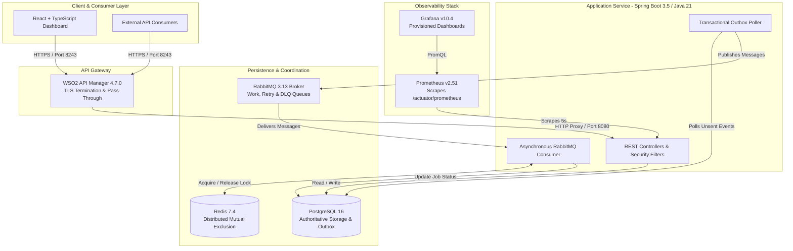
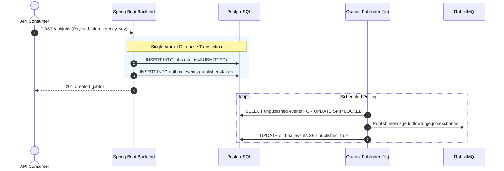
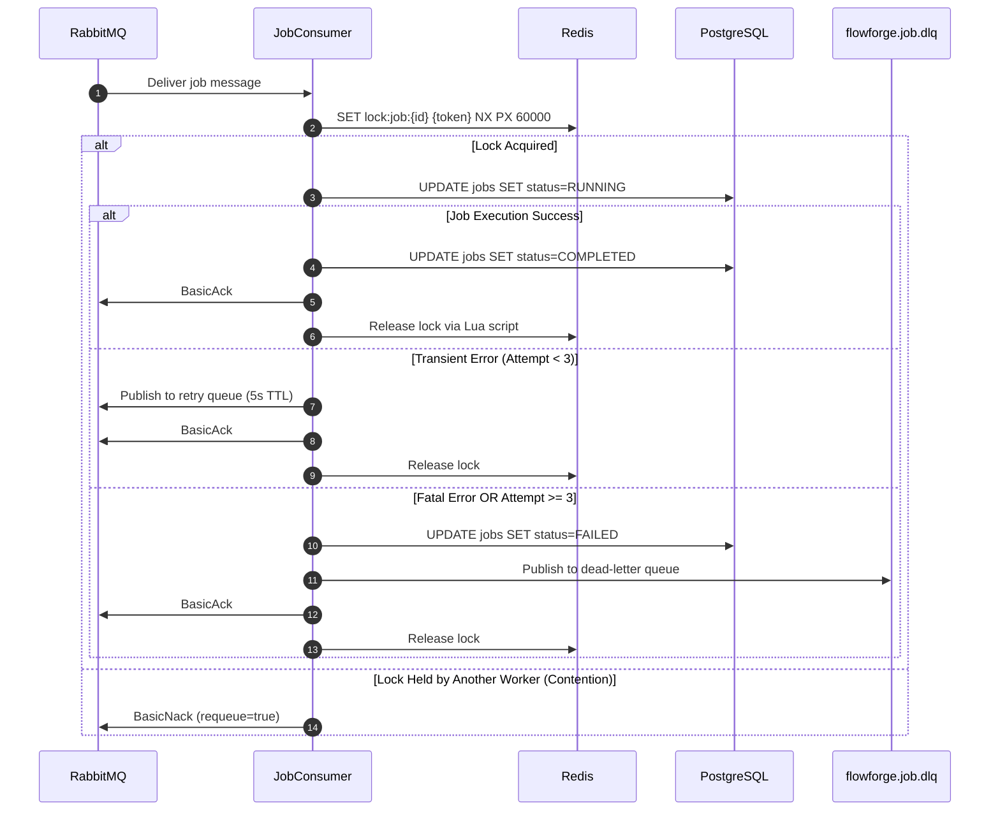
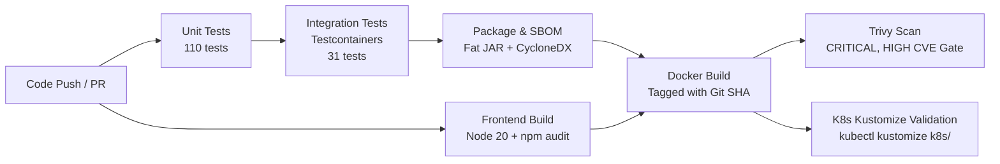

# FlowForge

> API Management & Distributed Workflow Platform built with Java 21, Spring Boot 3.5, PostgreSQL, RabbitMQ, Redis, WSO2 API Manager 4.7.0, and Kubernetes.

[](https://github.com/Sajini3655/Flowforge/actions/workflows/ci.yml)


---

## Overview

FlowForge is an API management and asynchronous distributed workflow execution platform designed for production reliability and distributed coordination:
- **API Management (WSO2 APIM 4.7.0)**: Dynamic API registration via `POST /api/apis`, automatic API creation in WSO2 Publisher, lifecycle management (`PUBLISHED`, `DEPRECATED`), revision deployment, and TLS-terminated Gateway routing with RS256 JWT validation against FlowForge's JWKS endpoint.
- **Dual-Write Consistency**: Eliminates message-loss race conditions between relational databases and message brokers via the **Transactional Outbox Pattern** with dedicated background polling.
- **Strict Idempotency & Deduplication**: Prevents duplicate executions from network retries using database-backed unique constraints and SHA-256 request fingerprinting.
- **Asynchronous Reliability Pipeline**: RabbitMQ delayed retry queue (5s TTL) with exponential attempt tracking, automatic Dead-Letter Queue (`flowforge.job.dlq`) routing on 3rd attempt failure, and manual recovery via `POST /api/jobs/{id}/retry`.
- **Distributed Mutual Exclusion**: Redis cluster-safe locking (`SET NX PX` + atomic Lua script release) preventing duplicate concurrent job execution across horizontally scaled workers.
- **Zero-Trust Security**: Asymmetric RS256 JWT authentication, BCrypt password hashing, role-based access control (`ROLE_ADMIN`, `ROLE_USER`), and a public JWKS endpoint (`/.well-known/jwks.json`).
- **Full Observability**: Micrometer instrumentation, `/actuator/prometheus` scraping, Prometheus alerting rules, and provisioned Grafana dashboards.

> **Implementation Scope & Engineering Honesty**:
> - **Fully Implemented & Automated Locally**: Core REST API, dynamic WSO2 API Manager 4.7.0 integration, Transactional Outbox, RabbitMQ worker queues, delayed retry queue, Dead Letter Queue, Redis locking, RS256 authentication, 110 unit tests + 31 integration tests (100% passing), and full Docker Compose environment.
> - **Kubernetes Architecture**: Declarative Kustomize manifests (`k8s/`) are included and locally validated; cloud deployment is not part of the current project scope.

---

## Architecture



> Detailed architectural specifications and sequence diagrams are available in [docs/architecture/system-architecture.md](docs/architecture/system-architecture.md).

---

## Engineering Highlights

- **Transactional Outbox Pattern**: Workflow jobs and outbox events are committed atomically inside a single PostgreSQL database transaction. A dedicated background poller reads unpublished events and reliably publishes them to RabbitMQ, guaranteeing at-least-once message delivery.
- **Strict Idempotency**: API endpoints accept an optional `Idempotency-Key` header with SHA-256 request fingerprinting. Cached responses are returned for duplicate submissions, preventing redundant asynchronous jobs.
- **Asynchronous Reliability Pipeline**: RabbitMQ topology with message TTL and dead-letter exchanges (DLX) provides non-blocking exponential backoff (`flowforge.job.retry.queue`). Poison pills exceeding 3 attempts are isolated into `flowforge.job.dlq`.
- **Distributed Mutual Exclusion**: Redis cluster-safe locking using atomic `SET NX PX` and an atomic Lua release script prevents multiple worker replicas from processing the same job concurrently, with fail-closed semantics.
- **Asymmetric RS256 Authentication**: User credentials hashed with BCrypt. JWTs are signed with a 2048-bit RSA private key; public keys are exposed via standard JWKS (`/.well-known/jwks.json`) for verification by downstream services and WSO2 APIM.
- **Production Observability**: 14 Micrometer custom metrics exposed at `/actuator/prometheus`, 5 Prometheus alert rules (`FlowForgeBackendDown`, `FlowForgeDlqPublicationDetected`, etc.), and an automated Grafana dashboard with real-time throughput and contention tracking.
- **Cloud-Native Kubernetes Manifests**: 15 declarative manifests assembled with Kustomize (`k8s/`), implementing non-root Pod Security Standards, HPA autoscaling (2–10 replicas), 3-tier health probes, and persistent volumes.

---

## Tech Stack

| Domain | Technology | Version | Purpose |
| :--- | :--- | :--- | :--- |
| **Backend Runtime** | Java / Eclipse Temurin | 21 (LTS) | Modern Java runtime with virtual-thread capability |
| **Application Framework** | Spring Boot | 3.5.16 | REST controllers, Spring Security, Spring Data JPA |
| **Database** | PostgreSQL | 16 | Relational persistence, Flyway migrations V1–V8 |
| **Message Broker** | RabbitMQ | 3.13 | Asynchronous queueing, delayed retries, DLQ |
| **Distributed Cache** | Redis | 7.4 | Distributed locking (`SET NX PX` + Lua) |
| **API Gateway** | WSO2 API Manager | 4.7.0 | TLS termination, proxy routing, token pass-through |
| **Metrics & Monitoring** | Prometheus & Grafana | v2.51 / v10.4 | Metrics scraping, alert rules, visualization |
| **Containerization** | Docker | Multi-stage | Non-root runtime image (`eclipse-temurin:21-jre`) |
| **Orchestration** | Kubernetes & Kustomize | v1.30+ | Declarative cloud-native deployment topology |
| **Testing** | JUnit 5 & Testcontainers | 1.20 | Integration testing with live PostgreSQL & RabbitMQ |
| **CI/CD** | GitHub Actions | v4 | Automated unit/integration tests, SBOM, Trivy scan |
| **Frontend** | React + TypeScript | Vite 7 / Node 20 | Administrative dashboard |

---

## Key Design Decisions & Workflows

### 1. Transactional Outbox Flow


### 2. Worker Processing, Retries & Dead Letter Queue (DLQ)


---

## Testing

FlowForge maintains a strict test pyramid with **141 total automated tests (100% passing)**:

- **110 Unit Tests**: Unit verification of security filters, JWT signing/parsing, API controllers, outbox publisher, idempotency logic, WSO2 integration, and metric counters.
- **31 Integration Tests (Testcontainers)**: Live multi-container integration testing using ephemeral PostgreSQL and RabbitMQ instances:
  - `SecurityIT` (10 tests): RS256 token verification, claims validation, RBAC enforcement, expired token rejection.
  - `JobApiIT` (10 tests): Idempotency caching, SHA-256 fingerprint collision prevention, job state transitions.
  - `RedisLockIT` (5 tests): Mutual exclusion, fail-closed handling, token-safe Lua release.
  - `MessagingIT` (2 tests): Outbox publication, non-blocking delayed retries, and DLQ routing.
  - `ObservabilityIT` (4 tests): Prometheus metric registration and health probe endpoints.

```bash
# Run unit tests
mvn clean test -f backend/pom.xml

# Run integration tests (requires Docker)
mvn -Pintegration verify -f backend/pom.xml
```

---

## Security

- **Asymmetric RS256 Cryptography**: Passwords hashed with BCrypt. JWTs are signed with a 2048-bit RSA private key; public keys are served at `/api/.well-known/jwks.json`.
- **Role-Based Access Control**:
  - `ROLE_USER` or `ROLE_ADMIN`: Submit and query asynchronous jobs (`/api/jobs/**`).
  - `ROLE_ADMIN`: Manage API definitions (`/api/apis/**`).
  - Anonymous: Permitted only on health probes, JWKS, and login/registration endpoints.
- **Traceability & Correlation**: `CorrelationIdFilter` inspects `X-Correlation-ID` (or generates a UUID) and injects it into the SLF4J Mapped Diagnostic Context (MDC) for end-to-end distributed log tracing.
- **Secret Protection**: Private RSA keys and sensitive Kubernetes manifests are excluded via `.gitignore`. A safe public template is provided at `k8s/secret.example.yaml`.
- **Container Hardening**: Backend runs as non-root user `flowforge` (UID 1000) on a minimal JRE base image. Kubernetes manifests enforce dropped Linux capabilities (`drop: ["ALL"]`) and disabled privilege escalation.

---

## Running Locally

### Prerequisites
- Java 21 & Maven 3.9+
- Node.js 20+ & npm
- Docker Desktop

### 1. Quick Start via Docker Compose (Recommended)
Starts PostgreSQL, RabbitMQ, Redis, Prometheus, Grafana, and the FlowForge backend:

```bash
docker compose up --build -d
```
- Backend API: `http://localhost:8080`
- Prometheus: `http://localhost:9090`
- Grafana: `http://localhost:3000` (pre-configured dashboards)
- RabbitMQ Management: `http://localhost:15673`

For local host-process development, the backend defaults are aligned to the Compose services via the `local` profile:

```bash
cd backend
mvn spring-boot:run
```

This uses:
- PostgreSQL: `jdbc:postgresql://localhost:5433/flowforge` (port 5433 avoids collisions with local host services; port 5432 is also mapped)
- username: `flowforge`
- password: `flowforge`
- RabbitMQ: `localhost:5673`
- Redis: `localhost:6379`

### 2. End-to-End System Demonstrations

#### Demo 1 — API Management (Dynamic WSO2 Gateway Registration)
```bash
# 1. Obtain Admin JWT Token
TOKEN=$(curl -s -X POST http://localhost:8080/api/auth/login \
  -H "Content-Type: application/json" \
  -d '{"email":"admin@flowforge.local","password":"Admin123!"}' | jq -r .token)

# 2. Register API in FlowForge -> Automatically published and deployed to WSO2
curl -s -X POST http://localhost:8080/api/apis \
  -H "Authorization: Bearer $TOKEN" \
  -H "Content-Type: application/json" \
  -d '{"name":"Orders Service API","version":"v1","basePath":"/orders","backendUrl":"http://backend:8080/api/health"}'

# 3. Invoke WSO2 Gateway (TLS + RS256 token verification -> upstream routing)
curl -k -i -H "Authorization: Bearer $TOKEN" https://localhost:8243/orders/v1/ready
```

> [!NOTE]
> **WSO2 TLS Configuration**: In local development with Docker Compose, WSO2 API Manager uses default self-signed certificates, enabled via `FLOWFORGE_WSO2_INSECURE_TLS=true`. In production, `flowforge.wso2.insecure-tls` defaults to `false` and validates against the system CA trust store.

#### Demo 2 — Successful Asynchronous Workflow
```bash
# Submit ECHO job with Idempotency Key -> Outbox -> RabbitMQ -> Worker -> COMPLETED
curl -s -X POST http://localhost:8080/api/jobs \
  -H "Authorization: Bearer $TOKEN" \
  -H "Idempotency-Key: demo-echo-001" \
  -H "X-Correlation-ID: flowforge-corr-001" \
  -H "Content-Type: application/json" \
  -d '{"type":"ECHO","requestPayload":"{\"message\":\"Hello FlowForge\"}"}'
```

#### Demo 3 — Reliability Pipeline & Dead-Letter Queue (DLQ)
```bash
# Simulate poison pill -> Attempt 1 (fail) -> Retry Queue (5s delay) -> Attempt 2 (fail) -> Attempt 3 (fail) -> FAILED / DLQ
curl -s -X POST http://localhost:8080/api/jobs \
  -H "Authorization: Bearer $TOKEN" \
  -H "Idempotency-Key: demo-fail-001" \
  -H "Content-Type: application/json" \
  -d '{"type":"TRANSIENT_FAILURE","requestPayload":"{\"simulation\":\"SERVICE_TIMEOUT\"}"}'
```

#### Demo 4 — Manual Recovery from DLQ
```bash
# Manually recover failed job -> Resets attempts to 0, status to QUEUED -> Re-executes via Outbox
curl -s -X POST http://localhost:8080/api/jobs/{jobId}/retry \
  -H "Authorization: Bearer $TOKEN"
```

---

## CI/CD Pipeline

Automated via GitHub Actions ([`.github/workflows/ci.yml`](.github/workflows/ci.yml)):



---

## Project Structure

```text
flowforge/
├── .github/workflows/         # GitHub Actions CI/CD pipeline
├── backend/                   # Spring Boot 3.5 / Java 21 REST backend
│   ├── src/main/java/         # Application code (API, Jobs, Outbox, Messaging, Security)
│   ├── src/main/resources/    # Flyway migrations V1-V8 & application properties
│   ├── src/test/java/         # Unit tests and Testcontainers integration suites
│   └── Dockerfile             # Multi-stage non-root container build
├── frontend/                  # React + TypeScript administrative dashboard (Vite)
├── infra/                     # Local infrastructure configurations
│   ├── grafana/               # Automated provisioning & dashboards
│   ├── prometheus/            # Scrape config & alerting rules
│   └── wso2/                  # WSO2 API Manager deployment config & publish scripts
├── k8s/                       # Cloud-native Kubernetes manifests (Kustomize)
└── docs/                      # Technical documentation
    ├── architecture/          # System architecture specification & sequence diagrams
    ├── decisions/             # Architecture Decision Records (ADRs)
    └── deployment/            # Deployment & operations guide
```

---

## Documentation

- **[System Architecture Specification](docs/architecture/system-architecture.md)**: Deep dive into all architectural tiers, outbox patterns, retry queues, DLQ routing, and Redis locking.
- **[Deployment & Operations Guide](docs/deployment/README.md)**: Docker Compose orchestration, Kubernetes manifest validation, and Prometheus/Grafana operations.
- **[Architecture Decision Records](docs/decisions/)**: Foundational decisions and design trade-offs.
