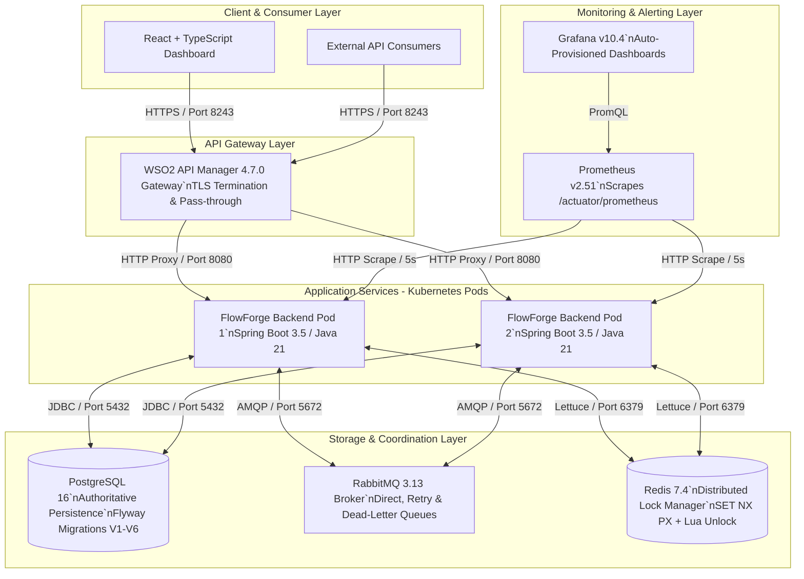
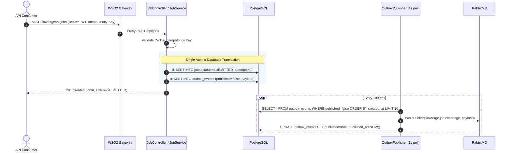
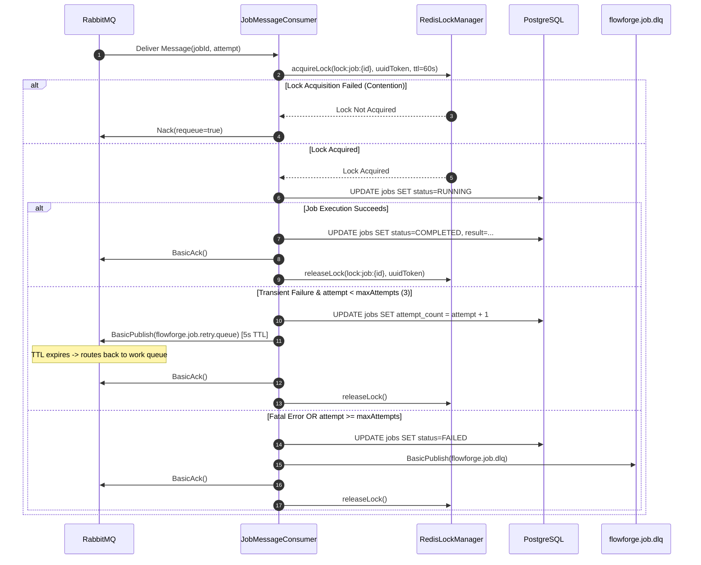
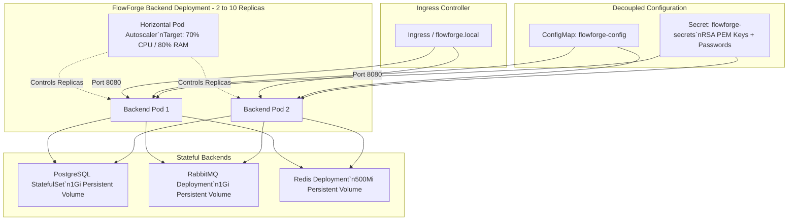

# FlowForge — Production System Architecture & Design Specification

FlowForge is an enterprise-grade API Management and Distributed Workflow Platform engineered in Java 21 and Spring Boot 3.5. It provides secure API gateway proxying, guaranteed at-least-once asynchronous job execution, distributed locking, and cloud-native observability.

---

## 1. Overall System Architecture

---

## 2. Component Specifications

### 2.1 API Gateway: WSO2 API Manager 4.7.0
* **Role**: Reverse proxy, TLS termination, API routing, and gateway pass-through.
* **Security Model**: Pass-through architecture (`authType: "None"`). WSO2 terminates client TLS and relays client Bearer tokens directly in the `Authorization` header to the backend.
* **Native JWKS**: WSO2 is configured with `[[apim.jwt.issuer]]` referencing the FlowForge public JWKS endpoint (`/api/.well-known/jwks.json`) for optional API-level token introspection.
* **Traffic Routing**: Relays `/flowforge/v1/*` requests to the backend service `http://backend:8080/api/*`.

### 2.2 Application Backend: Spring Boot 3.5 / Java 21
* **Role**: REST API hosting, business logic validation, transactional outbox publishing, worker job processing, and metrics exposure.
* **Security**: RS256 asymmetric JWT authentication with RSA public/private key pairs. Stateless session management with Role-Based Access Control (`ROLE_USER`, `ROLE_ADMIN`).
* **Correlation Tracking**: `CorrelationIdFilter` inspects or generates `X-Correlation-ID` and injects it into the SLF4J / Logback Mapped Diagnostic Context (MDC) for distributed log correlation across threads.

### 2.3 Relational Persistence: PostgreSQL 16
* **Role**: Authoritative single source of truth for all domain entities.
* **Schema Evolution**: Flyway migrations `V1` through `V6` execute deterministically on startup:
  - `V1__init.sql`: Core schema (users, roles, API definitions).
  - `V2__jobs.sql`: Workflow jobs table with statuses (`SUBMITTED`, `RUNNING`, `COMPLETED`, `FAILED`).
  - `V3__idempotency.sql`: Unique idempotency keys and request payload fingerprinting (`SHA-256`).
  - `V4__outbox.sql`: Transactional outbox events table for atomic state transitions.
  - `V5__dlq_support.sql`: Error tracking, attempt counters, and failure causes.
  - `V6__indices.sql`: Optimized indexes for outbox polling, status lookups, and owner queries.

### 2.4 Asynchronous Messaging: RabbitMQ 3.13
* **Topology**:
  - **Work Exchange & Queue**: `flowforge.job.exchange` (direct) routing to `flowforge.job.queue`.
  - **Retry Queue**: `flowforge.job.retry.queue` configured with message TTL (`x-message-ttl: 5000ms`) and dead-letter exchange (`x-dead-letter-exchange: flowforge.job.exchange`) for non-blocking exponential backoff.
  - **Dead Letter Queue (DLQ)**: `flowforge.job.dlq` configured with routing key `flowforge.job.dlq` to isolate poisoned messages and fatal errors after maximum retry attempts (default: 3).

### 2.5 Distributed Coordination: Redis 7.4
* **Role**: Cluster-wide distributed mutual exclusion locks preventing concurrent execution of identical jobs across multiple backend replicas.
* **Lock Algorithm**:
  - Acquisition: Single atomic Redis command `SET lock:job:{id} {token} NX PX {ttl}` (default: 60,000ms).
  - Release: Atomic Lua script ensuring that only the worker holding the exact UUID token can release the lock.
  - **Fail-Closed Semantics**: If Redis becomes unavailable, workers fail closed and reject job execution to guarantee data consistency.

---

## 3. End-to-End Workflow & Reliability Flows

### 3.1 Asynchronous Job Submission & Transactional Outbox Flow

### 3.2 Distributed Worker Processing, Retries & Dead Letter Queue (DLQ) Flow

---

## 4. Cloud-Native Kubernetes Architecture

The platform provides a declarative Kubernetes topology under `k8s/` assembled via Kustomize:

### 4.1 Pod Hardening & Security Context
* Pod-level `securityContext`: `runAsNonRoot: true`, `runAsUser: 1000`, `fsGroup: 1000`.
* Container-level `securityContext`: `allowPrivilegeEscalation: false`, `capabilities: drop: ["ALL"]`.
* Three-tier Kubernetes health probes:
  - `startupProbe`: `/api/health/live` (initialDelay: 15s, period: 5s, failureThreshold: 30) for JVM warmup.
  - `livenessProbe`: `/api/health/live` (period: 15s, timeout: 5s) for dead-lock recovery.
  - `readinessProbe`: `/api/health/ready` (period: 10s, timeout: 5s) verifying PostgreSQL, RabbitMQ, and Redis connectivity before receiving ingress traffic.

---

## 5. Production Observability Architecture

* **Prometheus Scraping**: Scrapes `/actuator/prometheus` at a 5-second interval across all backend instances.
* **Custom Metric Instrumentation (`FlowForgeMetrics`)**:
  - `flowforge_jobs_submitted_total`: Counter tracking total submissions by type.
  - `flowforge_jobs_completed_total`: Counter tracking successful job executions.
  - `flowforge_jobs_failed_total`: Counter tracking failed executions.
  - `flowforge_jobs_dlq_publications_total`: Counter tracking messages sent to DLQ.
  - `flowforge_outbox_events_created_total`: Counter tracking outbox events created.
  - `flowforge_outbox_events_published_total`: Counter tracking successful publications.
  - `flowforge_outbox_events_publish_failures_total`: Counter tracking publish errors.
  - `flowforge_redis_lock_acquired_total`: Counter tracking lock acquisitions.
  - `flowforge_redis_lock_acquisition_failures_total`: Counter tracking lock failures.
  - `flowforge_redis_lock_contention_total`: Counter tracking lock contention events.
  - `flowforge_job_execution_duration_seconds`: Histogram measuring execution duration percentiles.
* **Active Prometheus Alerting Rules**:
  1. `FlowForgeBackendDown`: Triggers on backend instance outage > 15s (`severity: critical`).
  2. `FlowForgeDlqPublicationDetected`: Triggers on any message routed to DLQ (`severity: warning`).
  3. `FlowForgeOutboxPublishFailure`: Triggers when outbox publisher encounters errors (`severity: warning`).
  4. `FlowForgeHighLockContention`: Triggers on > 5 lock contention events/min (`severity: info`).
  5. `FlowForgeJobFailuresDetected`: Triggers on terminal job failure (`severity: warning`).
* **Grafana Dashboards**: Automatically provisioned dashboard (`infra/grafana/dashboards/flowforge-overview.json`) providing real-time stat cards, throughput timeseries, outbox dynamics, and Redis contention rates.
